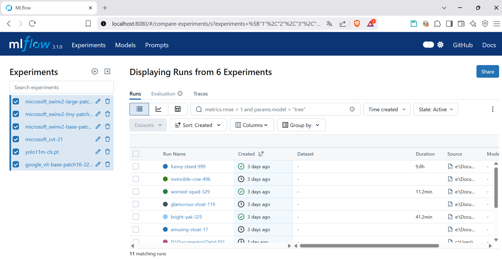

# MLflow

Este proyecto utiliza MLflow para el seguimiento de experimentos y la gestión de modelos. MLflow es una plataforma de código abierto que facilita la gestión del ciclo de vida de los modelos de machine learning, incluyendo el seguimiento de experimentos, la reproducción de resultados y la implementación de modelos. Más información sobre MLflow se puede encontrar en su [documentación oficial](https://www.mlflow.org/docs/latest/index.html).

## Uso en el proyecto

En este proyecto, todos los modelos se registraron en MLflow, lo que permitió realizar un seguimiento de los experimentos y comparar los resultados de diferentes configuraciones de modelos. Los experimentos se registran automáticamente al ejecutar los scripts de entrenamiento, y se pueden visualizar en la interfaz web de MLflow.

## Ejemplo de seguimiento de experimentos

En la siguiente imagen se puede ver los experimentos registrados para este proyecto:

