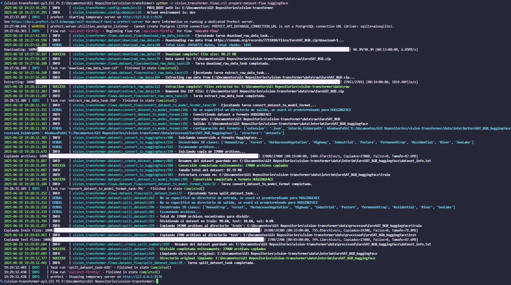
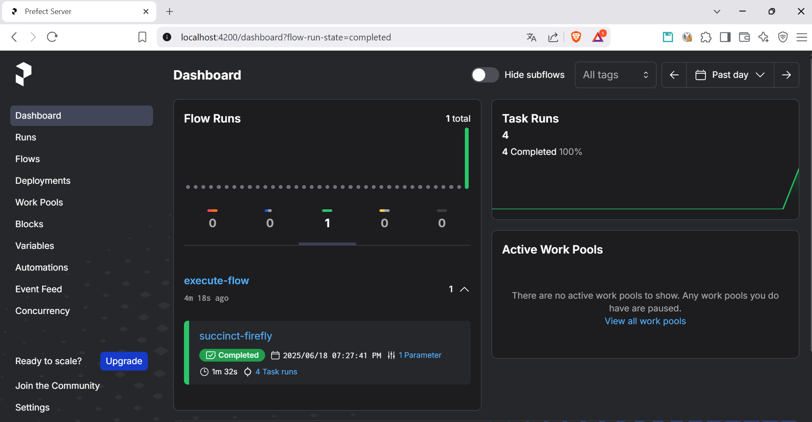

# Prefect

Este proyecto utiliza Prefect para la orquestación de flujos de trabajo y tareas automatizadas. Prefect es una herramienta que permite definir, programar y monitorear flujos de trabajo de manera eficiente. Más información sobre Prefect se puede encontrar en su [documentación oficial](https://docs.prefect.io/).

## Flujos definidos

Actualmente, se ha definido un flujo principal que se encarga de descargar y preprocesar el conjunto de datos EuroSAT. Este flujo se encuentra en el archivo `dataset_flow.py` y se ejecuta utilizando Prefect.

Existe un cliente `cli.py` que permite ejecutar el flujo desde la línea de comandos. Para ejecutar el flujo, puedes utilizar el siguiente comando:

```bash
python -m vision_transformer.flows.cli prepare-dataset-flow huggingface
```

Este flujo realiza las siguientes tareas:

1. **Descarga del conjunto de datos**: Descarga el conjunto de datos de EuroSAT en su versión RGB.
2. **Extracción de datos**: Extrae las imágenes del archivo descargado (como ZIP).
3. **Conversión a formato HuggingFace**: Convierte las imágenes a un formato compatible con Hugging Face, creando un dataset que puede ser utilizado por los modelos de Vision Transformer.
4. **Split del dataset**: Divide el conjunto de datos en conjuntos de entrenamiento, validación y prueba, asegurando que las proporciones sean adecuadas para el entrenamiento de modelos.

## Ejemplo de ejecución

Puedes ver un ejemplo de ejecución del flujo en la siguiente imagen:



En este ejemplo podemos observar la ejecución de cada uno de los pasos del flujo (el flujo está dividido en varias tareas), desde la descarga del conjunto de datos hasta la conversión y división en conjuntos de entrenamiento, validación y prueba.

También se puede observar la operación exitosa en el dashboard:


