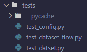
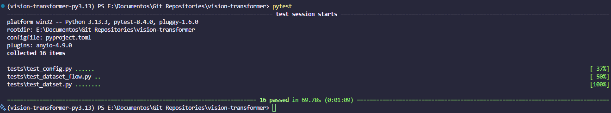

# Tests

Este proyecto incluye una serie de pruebas para asegurar la calidad del código y el correcto funcionamiento de los modelos implementados. Las pruebas consisten en test unitarios que verifican el comportamiento esperado de las funciones y clases.

Se utiliza la librería `pytest` para la ejecución de las pruebas. Esta herramienta permite definir y ejecutar pruebas de manera sencilla, proporcionando un informe detallado de los resultados. Más información sobre `pytest` se puede encontrar en su [documentación oficial](https://docs.pytest.org/en/stable/).

Para ejecutar las pruebas, partiendo de que tienes el ambiente configurado, puedes utilizar el siguiente comando:

```bash
pytest
```

Las pruebas están organizadas en el directorio `tests`. Actualmente existen pruebas para los siguientes módulos:

- `test_config.py`: Verifica la correcta carga y validación de la configuración del proyecto.
- `test_dataset.py`: Comprueba la correcta carga y preprocesamiento del conjunto de datos EuroSAT.
- `test_dataset_flow`: Verifica el flujo de trabajo de carga y preprocesamiento del conjunto de datos utilizando Prefect. 

La estructura de las pruebas es la siguiente:



## Ejemplo de ejecución

Se puede observar un ejemplo de ejecución de las pruebas en la siguiente imagen:



<!-- Test coverage + fotos -->
<!-- Ejemplo de test (fotos + gif) -->
